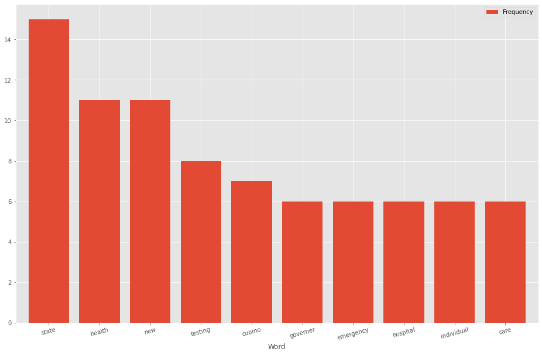

```python
import pandas as pd
import nltk
from collections import Counter

import matplotlib
import matplotlib.pyplot as plt

#C:\Users\elmsc\AppData\Roaming\nltk_data
#https://stackoverflow.com/questions/40206249/count-of-most-popular-words-in-a-pandas-dataframe?rq=1
```


```python
policy = pd.read_csv('policy.csv')
policy.info()
policy.head()
```

    <class 'pandas.core.frame.DataFrame'>
    RangeIndex: 4090 entries, 0 to 4089
    Data columns (total 19 columns):
     #   Column                  Non-Null Count  Dtype  
    ---  ------                  --------------  -----  
     0   Date                    4088 non-null   object 
     1   Location                4090 non-null   object 
     2   Level                   4090 non-null   object 
     3   Type                    4087 non-null   object 
     4   Title/Description       4090 non-null   object 
     5   Comments                1572 non-null   object 
     6   Travel restrictions     13 non-null     float64
     7   State of Emergency      15 non-null     float64
     8   School Closure          21 non-null     float64
     9   Work Closure            9 non-null      float64
     10  Business closing        15 non-null     float64
     11  Gatherings              17 non-null     float64
     12  COVID/Antibody Testing  30 non-null     float64
     13  Safer at Home           12 non-null     float64
     14  Reopening               71 non-null     float64
     15  Relief/Funding/Grant    61 non-null     float64
     16  Masks                   8 non-null      float64
     17  Other                   144 non-null    float64
     18  Economics               0 non-null      float64
    dtypes: float64(13), object(6)
    memory usage: 607.2+ KB
    


<div>
<style scoped>
    .dataframe tbody tr th:only-of-type {
        vertical-align: middle;
    }

    .dataframe tbody tr th {
        vertical-align: top;
    }

    .dataframe thead th {
        text-align: right;
    }
</style>
<table border="1" class="dataframe">
  <thead>
    <tr style="text-align: right;">
      <th></th>
      <th>Date</th>
      <th>Location</th>
      <th>Level</th>
      <th>Type</th>
      <th>Title/Description</th>
      <th>Comments</th>
      <th>Travel restrictions</th>
      <th>State of Emergency</th>
      <th>School Closure</th>
      <th>Work Closure</th>
      <th>Business closing</th>
      <th>Gatherings</th>
      <th>COVID/Antibody Testing</th>
      <th>Safer at Home</th>
      <th>Reopening</th>
      <th>Relief/Funding/Grant</th>
      <th>Masks</th>
      <th>Other</th>
      <th>Economics</th>
    </tr>
  </thead>
  <tbody>
    <tr>
      <th>0</th>
      <td>3/6/2020</td>
      <td>Alabama</td>
      <td>State</td>
      <td>Announcement</td>
      <td>Formation of COVID-19 Task Force</td>
      <td>NaN</td>
      <td>NaN</td>
      <td>NaN</td>
      <td>NaN</td>
      <td>NaN</td>
      <td>NaN</td>
      <td>NaN</td>
      <td>NaN</td>
      <td>NaN</td>
      <td>NaN</td>
      <td>NaN</td>
      <td>NaN</td>
      <td>1.0</td>
      <td>NaN</td>
    </tr>
    <tr>
      <th>1</th>
      <td>3/10/2020</td>
      <td>Alabama</td>
      <td>State</td>
      <td>Announcement</td>
      <td>State employees must notify of recent travel</td>
      <td>if they have traveled in areas affected by cor...</td>
      <td>1.0</td>
      <td>NaN</td>
      <td>NaN</td>
      <td>NaN</td>
      <td>NaN</td>
      <td>NaN</td>
      <td>NaN</td>
      <td>NaN</td>
      <td>NaN</td>
      <td>NaN</td>
      <td>NaN</td>
      <td>NaN</td>
      <td>NaN</td>
    </tr>
    <tr>
      <th>2</th>
      <td>3/13/2020</td>
      <td>Alabama</td>
      <td>State</td>
      <td>Issued</td>
      <td>State of Emergency</td>
      <td>NaN</td>
      <td>NaN</td>
      <td>1.0</td>
      <td>NaN</td>
      <td>NaN</td>
      <td>NaN</td>
      <td>NaN</td>
      <td>NaN</td>
      <td>NaN</td>
      <td>NaN</td>
      <td>NaN</td>
      <td>NaN</td>
      <td>NaN</td>
      <td>NaN</td>
    </tr>
    <tr>
      <th>3</th>
      <td>3/14/2020</td>
      <td>Alabama</td>
      <td>State</td>
      <td>Ordered</td>
      <td>Public school closure</td>
      <td>for 2.5 weeks</td>
      <td>NaN</td>
      <td>NaN</td>
      <td>1.0</td>
      <td>NaN</td>
      <td>NaN</td>
      <td>NaN</td>
      <td>NaN</td>
      <td>NaN</td>
      <td>NaN</td>
      <td>NaN</td>
      <td>NaN</td>
      <td>NaN</td>
      <td>NaN</td>
    </tr>
    <tr>
      <th>4</th>
      <td>3/15/2020</td>
      <td>Alabama</td>
      <td>State</td>
      <td>Authorization</td>
      <td>Changing work schedules</td>
      <td>directors of all state agencies change schedul...</td>
      <td>NaN</td>
      <td>NaN</td>
      <td>NaN</td>
      <td>1.0</td>
      <td>NaN</td>
      <td>NaN</td>
      <td>NaN</td>
      <td>NaN</td>
      <td>NaN</td>
      <td>NaN</td>
      <td>NaN</td>
      <td>NaN</td>
      <td>NaN</td>
    </tr>
  </tbody>
</table>
</div>


```python
policy.fillna('none',inplace=True)
policy.head()
```


<div>
<style scoped>
    .dataframe tbody tr th:only-of-type {
        vertical-align: middle;
    }

    .dataframe tbody tr th {
        vertical-align: top;
    }

    .dataframe thead th {
        text-align: right;
    }
</style>
<table border="1" class="dataframe">
  <thead>
    <tr style="text-align: right;">
      <th></th>
      <th>Date</th>
      <th>Location</th>
      <th>Level</th>
      <th>Type</th>
      <th>Title/Description</th>
      <th>Comments</th>
      <th>Travel restrictions</th>
      <th>State of Emergency</th>
      <th>School Closure</th>
      <th>Work Closure</th>
      <th>Business closing</th>
      <th>Gatherings</th>
      <th>COVID/Antibody Testing</th>
      <th>Safer at Home</th>
      <th>Reopening</th>
      <th>Relief/Funding/Grant</th>
      <th>Masks</th>
      <th>Other</th>
      <th>Economics</th>
    </tr>
  </thead>
  <tbody>
    <tr>
      <th>0</th>
      <td>3/6/2020</td>
      <td>Alabama</td>
      <td>State</td>
      <td>Announcement</td>
      <td>Formation of COVID-19 Task Force</td>
      <td>none</td>
      <td>none</td>
      <td>none</td>
      <td>none</td>
      <td>none</td>
      <td>none</td>
      <td>none</td>
      <td>none</td>
      <td>none</td>
      <td>none</td>
      <td>none</td>
      <td>none</td>
      <td>1</td>
      <td>none</td>
    </tr>
    <tr>
      <th>1</th>
      <td>3/10/2020</td>
      <td>Alabama</td>
      <td>State</td>
      <td>Announcement</td>
      <td>State employees must notify of recent travel</td>
      <td>if they have traveled in areas affected by cor...</td>
      <td>1</td>
      <td>none</td>
      <td>none</td>
      <td>none</td>
      <td>none</td>
      <td>none</td>
      <td>none</td>
      <td>none</td>
      <td>none</td>
      <td>none</td>
      <td>none</td>
      <td>none</td>
      <td>none</td>
    </tr>
    <tr>
      <th>2</th>
      <td>3/13/2020</td>
      <td>Alabama</td>
      <td>State</td>
      <td>Issued</td>
      <td>State of Emergency</td>
      <td>none</td>
      <td>none</td>
      <td>1</td>
      <td>none</td>
      <td>none</td>
      <td>none</td>
      <td>none</td>
      <td>none</td>
      <td>none</td>
      <td>none</td>
      <td>none</td>
      <td>none</td>
      <td>none</td>
      <td>none</td>
    </tr>
    <tr>
      <th>3</th>
      <td>3/14/2020</td>
      <td>Alabama</td>
      <td>State</td>
      <td>Ordered</td>
      <td>Public school closure</td>
      <td>for 2.5 weeks</td>
      <td>none</td>
      <td>none</td>
      <td>1</td>
      <td>none</td>
      <td>none</td>
      <td>none</td>
      <td>none</td>
      <td>none</td>
      <td>none</td>
      <td>none</td>
      <td>none</td>
      <td>none</td>
      <td>none</td>
    </tr>
    <tr>
      <th>4</th>
      <td>3/15/2020</td>
      <td>Alabama</td>
      <td>State</td>
      <td>Authorization</td>
      <td>Changing work schedules</td>
      <td>directors of all state agencies change schedul...</td>
      <td>none</td>
      <td>none</td>
      <td>none</td>
      <td>1</td>
      <td>none</td>
      <td>none</td>
      <td>none</td>
      <td>none</td>
      <td>none</td>
      <td>none</td>
      <td>none</td>
      <td>none</td>
      <td>none</td>
    </tr>
  </tbody>
</table>
</div>


```python
ny = policy[policy['Location'] == 'New York']
ny.head()
```


<div>
<style scoped>
    .dataframe tbody tr th:only-of-type {
        vertical-align: middle;
    }

    .dataframe tbody tr th {
        vertical-align: top;
    }

    .dataframe thead th {
        text-align: right;
    }
</style>
<table border="1" class="dataframe">
  <thead>
    <tr style="text-align: right;">
      <th></th>
      <th>Date</th>
      <th>Location</th>
      <th>Level</th>
      <th>Type</th>
      <th>Title/Description</th>
      <th>Comments</th>
      <th>Travel restrictions</th>
      <th>State of Emergency</th>
      <th>School Closure</th>
      <th>Work Closure</th>
      <th>Business closing</th>
      <th>Gatherings</th>
      <th>COVID/Antibody Testing</th>
      <th>Safer at Home</th>
      <th>Reopening</th>
      <th>Relief/Funding/Grant</th>
      <th>Masks</th>
      <th>Other</th>
      <th>Economics</th>
    </tr>
  </thead>
  <tbody>
    <tr>
      <th>2321</th>
      <td>3/2/2020</td>
      <td>New York</td>
      <td>State</td>
      <td>Announcement</td>
      <td>School &amp; Public Transportation cleaning protoc...</td>
      <td>none</td>
      <td>none</td>
      <td>none</td>
      <td>none</td>
      <td>none</td>
      <td>none</td>
      <td>none</td>
      <td>none</td>
      <td>none</td>
      <td>none</td>
      <td>none</td>
      <td>none</td>
      <td>none</td>
      <td>none</td>
    </tr>
    <tr>
      <th>2322</th>
      <td>3/2/2020</td>
      <td>New York</td>
      <td>State</td>
      <td>Announcement</td>
      <td>Expand Testing to 1000 per day</td>
      <td>Wadsworth Center provides hospitals instructio...</td>
      <td>none</td>
      <td>none</td>
      <td>none</td>
      <td>none</td>
      <td>none</td>
      <td>none</td>
      <td>none</td>
      <td>none</td>
      <td>none</td>
      <td>none</td>
      <td>none</td>
      <td>none</td>
      <td>none</td>
    </tr>
    <tr>
      <th>2323</th>
      <td>3/2/2020</td>
      <td>New York</td>
      <td>State</td>
      <td>Declaration</td>
      <td>Governer directs health insurers to waive cost...</td>
      <td>The State Department will require health insur...</td>
      <td>none</td>
      <td>none</td>
      <td>none</td>
      <td>none</td>
      <td>none</td>
      <td>none</td>
      <td>none</td>
      <td>none</td>
      <td>none</td>
      <td>none</td>
      <td>none</td>
      <td>none</td>
      <td>none</td>
    </tr>
    <tr>
      <th>2324</th>
      <td>3/3/2020</td>
      <td>New York</td>
      <td>State</td>
      <td>Signed</td>
      <td>$40 million emergency funds for coronavirus re...</td>
      <td>Governer Cuomo signed an emergency management ...</td>
      <td>none</td>
      <td>none</td>
      <td>none</td>
      <td>none</td>
      <td>none</td>
      <td>none</td>
      <td>none</td>
      <td>none</td>
      <td>none</td>
      <td>none</td>
      <td>none</td>
      <td>none</td>
      <td>none</td>
    </tr>
    <tr>
      <th>2325</th>
      <td>3/3/2020</td>
      <td>New York</td>
      <td>State</td>
      <td>Announcement</td>
      <td>Governer will amend Paid Sick Leave budget to ...</td>
      <td>Governer Cuomo announced he will amend Paid Si...</td>
      <td>none</td>
      <td>none</td>
      <td>none</td>
      <td>none</td>
      <td>none</td>
      <td>none</td>
      <td>none</td>
      <td>none</td>
      <td>none</td>
      <td>none</td>
      <td>none</td>
      <td>none</td>
      <td>none</td>
    </tr>
  </tbody>
</table>
</div>


```python
top_N = 10

stopwords = nltk.corpus.stopwords.words('english')

print(' '.join(stopwords))
```

    i me my myself we our ours ourselves you you're you've you'll you'd your yours yourself yourselves he him his himself she she's her hers herself it it's its itself they them their theirs themselves what which who whom this that that'll these those am is are was were be been being have has had having do does did doing a an the and but if or because as until while of at by for with about against between into through during before after above below to from up down in out on off over under again further then once here there when where why how all any both each few more most other some such no nor not only own same so than too very s t can will just don don't should should've now d ll m o re ve y ain aren aren't couldn couldn't didn didn't doesn doesn't hadn hadn't hasn hasn't haven haven't isn isn't ma mightn mightn't mustn mustn't needn needn't shan shan't shouldn shouldn't wasn wasn't weren weren't won won't wouldn wouldn't
    


```python
# RegEx for stopwords
RE_stopwords = r'\b(?:{},;)\b'.format('|'.join(stopwords))

# replace '|'-->' ' and drop all stopwords
words = (ny.Comments
           .str.lower()
           .replace([r'\|', RE_stopwords], [' ', ''], regex=True)
           .str.cat(sep=' ')
           .split()
)
```


```python
# generate DF out of Counter
rslt = pd.DataFrame(Counter(words).most_common(top_N),
                    columns=['Word', 'Frequency']).set_index('Word')

print('all frequencies, not including stopwords: ')

print('=' * 60)
print(rslt)
print('=' * 60)
```

    All frequencies, not including stopwords: 
    ============================================================
                Frequency
    Word                 
    none              208
    state              15
    health             11
    new                11
    testing             8
    cuomo               7
    governer            6
    emergency           6
    hospital            6
    individual          6
    ============================================================
    


```python
words = (ny[ny['Comments']!='none'].Comments
           .str.lower()
           .replace([r'\|', RE_stopwords], [' ', ''], regex=True)
           .str.cat(sep=' ')
           .split()
)

rslt = pd.DataFrame(Counter(words).most_common(top_N),
                    columns=['Word', 'Frequency']).set_index('Word')

print('filtered frequencies, not including stopwords: ')

print('=' * 60)
print(rslt)
print('=' * 60)
```

    filtered frequencies, not including stopwords: 
    ============================================================
                Frequency
    Word                 
    state              15
    health             11
    new                11
    testing             8
    cuomo               7
    governer            6
    emergency           6
    hospital            6
    individual          6
    care                6
    ============================================================
    


```python
# plot
rslt.plot.bar(rot=15, figsize=(16,10), width=0.8)
```


    <matplotlib.axes._subplots.AxesSubplot at 0x2246a023508>





```python
!jupyter nbconvert --output-dir='output/' --to pdf new-york-policy.ipynb
!jupyter nbconvert --output-dir='output/' --to markdown new-york-policy.ipynb
!jupyter nbconvert --output-dir='output/' --to html new-york-policy.ipynb
!jupyter nbconvert --output-dir='output/' --to python new-york-policy.ipynb
```
